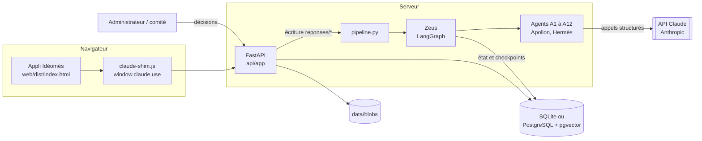

# Architecture technique

## Vue d'ensemble

## Choix structurants

- **L'appli reste une seule page HTML.** Son code est identique à celui de l'artefact claude.ai.
  Le fichier `claude-shim.js` réimplémente `window.claude.use("db" | "user" | "assets" | "downloads")`
  sur l'API locale : on peut donc continuer à faire évoluer l'artefact et le projet local en parallèle.
- **Modèle « documents »** (`documents` : collection, id, JSON) : même structure que la base de l'artefact
  (`reponses/<uid>`, `connexions/<uid>`, `actus/*`, `veille/*`, `config/*`, `adminconf/*`, `notifications/*`).
- **Dossier partagé** (`core/dossier.py`) : chaque agent lit le dossier et n'écrit que dans sa case
  `sorties[<id>]`. Tout est historisé.
- **Sorties structurées** : chaque appel à Claude force un outil `rendre_resultat` dont le schéma JSON
  est celui de l'agent ; sortie invalide = 2 relances maximum puis revue humaine.
- **Calculs hors LLM** : le score de Kairos, le géocodage de Gaïa, les regroupements d'Hestia et les
  agrégats d'Hélios sont du code déterministe et testé. Le LLM donne des notes et des justifications.
- **Données personnelles** : Thémis masque téléphones, e-mails, CNIB, IBAN **avant** tout appel à Claude
  (`core/texte.py`). Les agents suivants ne voient que le texte masqué.
- **Injection de consignes** : le texte citoyen est toujours placé dans `<donnees>` et chaque prompt
  rappelle qu'il ne contient jamais d'instructions.

## Tables

| Table | Rôle |
|---|---|
| documents | base de l'appli (collections JSON) |
| assets | fichiers (vidéo, images) servis sous `/_blob/<id>` |
| dossiers | un dossier par idée : statut, point d'attente, état complet du graphe |
| journal_audit | chaque étape de chaque agent (modèle, durée, jetons, confiance) |
| plongements (PostgreSQL) | vecteurs pour Hestia (pgvector, index HNSW) |

## Points d'extension

| Besoin | Où brancher |
|---|---|
| Vraie authentification (code WhatsApp, e-mail) | `api/app/securite.py` (`identite`) et `claude-shim.js` |
| Envoi réel WhatsApp / SMS / e-mail | consommer la collection `notifications` (statut `en_file`) |
| Transcription des vocaux, OCR des fiches papier | `agents/a01_demeter.py` |
| Plongements sémantiques | `agents/a04_hestia.py` + table `plongements` |
| Données INSD (population) | `Contexte.population` dans `api/app/pipeline.py` |
| Checkpoints PostgreSQL | `PostgresSaver` dans `api/app/pipeline.py` |
| Planification d'Hermès | cron / Planificateur de tâches : `ideomes veille` à 06:52 (heure de Ouagadougou) |
